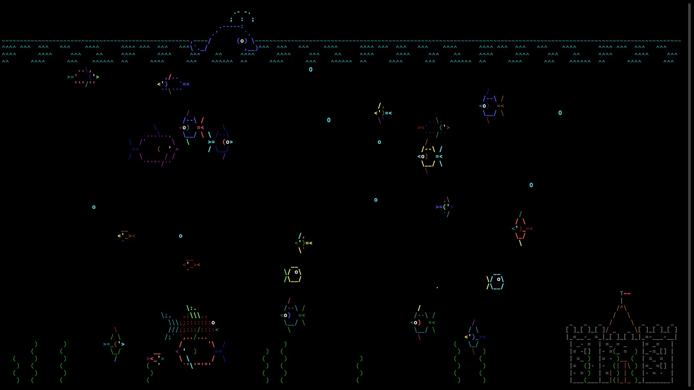

# Unofficial Snap Packaging for ASCIIQuarium
<!--
	Use the Staticaly service for easy access to in-repo pictures:
	https://www.staticaly.com/
-->
 Icon of ASCIIQuarium")

**This is the unofficial snap for ASCIIQuarium**, *"An aquarium/sea animation in ASCII art"*. It works on Ubuntu, Fedora, Debian, and other major Linux distributions.

<!-- Uncomment and modify this when you are provided a snap status badge

-->

<!-- Uncomment and modify this when you have a screenshot

-->

Published for  with 💝 by Snapcrafters

<!-- Uncomment and modify this when you have published the snap to the Snap Store
## Installation
([Don't have snapd installed?](https://snapcraft.io/docs/core/install))

### In a Terminal
    # Install the snap #
    sudo snap install --channel=edge --devmode asciiquarium
    #sudo snap install --channel=beta asciiquarium
    #sudo snap install asciiquarium
    
    # Connect the snap to essential security confinement interfaces #
    ## (Proper reasoning for connecting _plug_name_) ##
    sudo snap connect asciiquarium:_plug_name_
    
    # Connect the snap to optional security confinement interfaces #
    ## (Proper reasoning for connecting _plug_name_) ##
    sudo snap connect asciiquarium:_plug_name_
    
    # Launch the application #
    asciiquarium
    snap run asciiquarium # If you have another existing installation

### The Graphical Way

-->

<!-- Uncomment when you have test results
## What is Working
* [A list of functionallities that are verified working]

## What is NOT Working...yet 
Check out the [issue tracker](https://github.com/Lin-Buo-Ren/asciiquarium-snap/issues) for known issues.
-->

## Support
* Report issues regarding using this snap to the issue tracker:  
  <https://github.com/Lin-Buo-Ren/asciiquarium-snap/issues>
* You may also post on the Snapcraft Forum, under the `snap` topic category:  
  <https://forum.snapcraft.io/c/snap>
